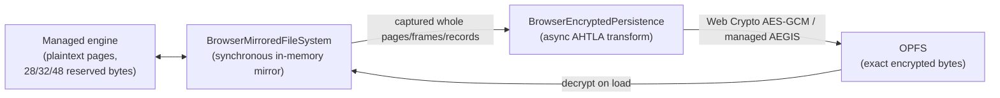

# Browser encrypted storage

`Devolutions.Ahtola.Data.Sqlite.Browser` stores databases in the Origin Private
File System (OPFS) and can encrypt them with Ahtola's AHTLA page format. An
encrypted browser database is a **plain Ahtola encrypted database**: it is not a
browser-specific container, it has no plaintext sidecar, and it opens on the
desktop with `AhtolaEncryptionOptions` (and vice versa).

## Why encryption happens at the persistence boundary

The desktop engine encrypts pages through `IPageCodec`
(`EncryptionPageCodec`), whose `EncodePage`/`DecodePage` are **synchronous**.
Browser Web Crypto (`SubtleCrypto`) is promise-based and has no synchronous
API, so it can never satisfy that contract on the .NET WebAssembly runtime.
Deriving the raw key and using `System.Security.Cryptography.AesGcm` instead is
not an option either: for the AES ciphers the package's crypto contract is Web
Crypto with non-extractable key handles.

The browser therefore splits the two concerns:



- The engine keeps operating on plaintext, synchronously, exactly as it does
  today. Nothing in `Ahtola.Core` becomes `async` for the browser's benefit.
- `AhtolaBrowserReservedSpaceCodec` is an **identity** `IPageCodec` that declares
  the configured cipher's reserved-byte count (28 for AES-GCM, 32 for the
  AEGIS-128 family, 48 for the AEGIS-256 family). Binding it makes the pager
  create databases with that reserved space from creation onward, and reject an
  existing database whose reserved space disagrees. Those bytes are where the
  16-byte tag and the cipher's nonce live once the page is encrypted. The codec
  id embeds the cipher id, so two configurations that produce different on-disk
  bytes never share an identity.
- `BrowserEncryptedPersistence` performs the actual AHTLA transform
  asynchronously while the mirror replays its pending mutations to OPFS.

## Cipher selection in the browser

SubtleCrypto implements AES-GCM only. `AhtolaBrowserPageCipherFactory` therefore
routes:

| Cipher | Backing implementation |
| ------ | ---------------------- |
| `Aes128Gcm`, `Aes256Gcm` | Web Crypto, non-extractable key handle (unchanged) |
| `Aegis256`, `Aegis256x2`, `Aegis256x4`, `Aegis128l`, `Aegis128x2`, `Aegis128x4` | `AhtolaManagedAegisPageCipher`, wrapping the pure-managed AEGIS core from `Ahtola.Core` |

The AEGIS path completes its `ValueTask` synchronously and performs no
JavaScript interop. Its output is byte-identical to the desktop engine's, which
the suite asserts by replaying the desktop framer with the nonce the browser
chose.

> **Performance.** WebAssembly has no AES round instruction, so AEGIS falls back
> to the constant-time bitsliced software round and is materially slower in the
> browser than AES-GCM through Web Crypto, which reaches native code. Choose
> AEGIS in the browser for on-disk compatibility with an AEGIS database, not for
> throughput.

Passphrase derivation (`Ahtola.Password.v1`) always produces an AES-256-GCM key,
so it never selects an AEGIS cipher. `ChaCha20Poly1305` is rejected: Turso
format version 0 assigns it no on-disk cipher id. See
[`page-encryption-contract.md`](page-encryption-contract.md).

### The two backends are not interchangeable

`AhtolaBrowserCryptoService` is the **Web Crypto** backend and nothing else. It
imports a non-extractable `AES-GCM` JavaScript key and every member is specified
in terms of AES-GCM's fixed 12-byte nonce and 16-byte tag, so it accepts only
`Aes128Gcm` and `Aes256Gcm`. Passing an AEGIS cipher throws
`ArgumentOutOfRangeException`.

That refusal matters because it cannot be caught by key length: an AEGIS-256 key
is 32 bytes, exactly a valid AES-256 key, and an AEGIS-128 key is 16 bytes,
exactly a valid AES-128 key. A service that accepted the cipher id and then
imported an AES-GCM key would report `Cipher = Aegis256` while producing AES-GCM
bytes — a cipher-confusion hazard that no downstream length check could detect.

`AhtolaManagedAegisPageCipher` is the **pure-managed AEGIS** backend, and it is
where every AEGIS cipher is served. It uses the cipher's real nonce width and
rejects an AES-GCM-shaped 12-byte nonce rather than padding or truncating it.

Both are selected by `AhtolaBrowserPageCipherFactory` on
`AhtolaBrowserCryptoParameters.UsesWebCrypto`, which is exactly the set of
ciphers whose nonce is 12 bytes. The suite pins each backend's output to
published vectors — CFRG `draft-irtf-cfrg-aegis-aead` for AEGIS, NIST GCM for
AES-GCM — so the cipher a seam reports is provably the cipher whose bytes it
produces.

`IPageCodecSource` (in `Ahtola.Core`) lets the mirror advertise its codec
without being wrapped in `AhtolaPageCodecFileSystem`. Wrapping would hide the
mirror's `IAtomicFileSystem`, `ITemporaryFileSystem`, `IStoragePathResolver`,
and `ISnapshotFileIdentity` implementations, which VACUUM, backup, and the
sorter depend on.

## What is encrypted, and how

`AhtolaEncryptedPageFormat` is the single definition of the byte layout, shared
by the synchronous desktop `AhtolaPageEncryption` and the asynchronous browser
transform. Files are classified by SQLite's naming conventions:

| File | Treatment |
| --- | --- |
| database (`x.db`, attached, VACUUM targets) | every page encrypted |
| `x.db-wal` | header plaintext; frame bodies encrypted; rolling checksums recomputed over the **encrypted** bytes |
| `x.db-journal` | header plaintext; page records encrypted; per-record checksum recomputed over the **encrypted** page |
| `x.db-shm` | passthrough — the WAL index is derived, rebuildable metadata |
| `x.db-log` | header/frame metadata plaintext; transaction payloads encrypted in authenticated chunks |

### Roles are tracked, not guessed from the suffix

A filename suffix alone cannot decide this. A perfectly legal database can be
named `notes-shm`, or attached as `archive-wal`, and treating it as a sidecar
would corrupt it or — for `-shm` — persist its pages in the clear. A path is a
sidecar only when:

1. its base database is already known (databases are discovered in open order at
   run time, and shortest-path-first at load, so a base is always resolved
   before anything derived from it), or the base file exists; or
2. the content positively identifies it: a WAL header magic, or a finalized
   rollback journal magic.

In all cases, content that starts with `AHTLA` or `SQLite format 3` vetoes the
sidecar role and the file is treated as a database.

### MVCC

The MVCC logical log (`x.db-log`) uses Turso's encrypted logical-log layout.
Its 56-byte log header, 24-byte transaction headers, and 8-byte trailers remain
visible for recovery framing. Each transaction payload is split into 32-KiB
chunks and encrypted with AES-GCM. Associated data binds the log salt, final
plaintext payload length, operation count, commit timestamp, chunk index, and
logical-log version. The trailer CRC covers the encrypted bytes. Recovery also
requires the decoded operation count to consume the authenticated payload
exactly; trailing bytes are corruption rather than forward-compatible padding.

Desktop storage performs that transform synchronously in `MvccLogicalLog`.
The browser mirror captures each complete plaintext frame, maps its logical
offset to the expanded encrypted offset, and encrypts it asynchronously with
the same non-extractable Web Crypto key used for pages. On load it authenticates
and decrypts complete frames before the managed engine replays them. This makes
`PRAGMA journal_mode=mvcc` and `BEGIN CONCURRENT` available without exposing key
material or persisting row data in plaintext.

#### MVCC requires an AES-GCM cipher

The `MVTX` chunk frame reserves a **fixed** 16-byte tag plus 12-byte nonce, and
that overhead is baked into every payload-size, offset, and CRC computation in
`MvccLogicalLogFormat`. Turso format version 0 defines no logical-log framing for
the wider AEGIS nonces (16 bytes for the AEGIS-128 family, 32 for AEGIS-256), so
rather than invent one, MVCC is refused for those ciphers.

The refusal happens at the `PRAGMA journal_mode` boundary, before journal-mode
header 255 is persisted and before any transaction produces a frame:

- Desktop storage answers from `AhtolaEncryptionFileSystem`'s cipher.
- The browser mirror encrypts *out of band*, on its way to OPFS, so the core
  cannot see its cipher through `AhtolaEncryptionFileSystem`. It declares the
  restriction through the `IMvccJournalModePolicy` capability instead.

Both routes produce the same `NotSupportedException` text, naming the cipher and
its nonce width. Without the gate the pragma succeeded, `COMMIT` reported
success, and the mismatch only surfaced during the asynchronous flush that
followed — after the engine had already reported durability, with the pager
already switched into a mode it could never commit in.

An AEGIS database is otherwise unaffected: a refused switch leaves the journal
mode untouched, and ordinary WAL or DELETE commits continue to persist and
survive reopen.

A header-only plaintext log can safely begin receiving encrypted frames because
it contains no row data. A populated plaintext log presented to encrypted
storage is rejected instead of being guessed or migrated in place; checkpoint
it with the original plaintext configuration first. Wrong keys, authenticated
metadata changes, and complete-frame tampering fail closed. A short final
encrypted frame is treated as a torn append and recovery retains only the
authenticated prefix.

Encrypted MVCC payloads written by the short-lived format that did not bind the
log version in associated data are deliberately not accepted: their tags do not
validate under the hardened format. They must be checkpointed by the exact
writer that created them before upgrading. There is no unauthenticated fallback
or automatic reinterpretation as a different log version.

Page 1 keeps a visible 100-byte header: the `AHTLA` magic, format version 0,
the cipher id, zeroed reserved bytes, and the SQLite header bytes 16..100
copied verbatim. That whole 100-byte prefix is authenticated as AES-GCM
associated data. Every other page has no associated data. This is byte-for-byte
what the desktop engine writes.

Because WAL and journal checksums must cover encrypted bytes, the transform
recomputes them rather than copying the engine's plaintext checksums. The WAL's
rolling chain is seeded by the WAL header's own checksum, which is identical in
both images because the header itself is never encrypted.

## Ordering and durability

The mirror records the engine's exact mutation stream. When encryption is
enabled, each write is **captured at enqueue time**, expanded to the whole
pages, WAL frames, or journal records it touches. Capturing eagerly (rather
than re-reading the final image at flush time) preserves the engine's exact
durability ordering — in particular that a rollback journal is durable before
the database pages it protects are overwritten.

A rollback journal record is built from three separate engine writes (page
number, page image, checksum). The transform persists nothing until the record
is complete, because the encrypted checksum cannot be derived from a partial
page. Records are still emitted before the journal's flush, so crash recovery
is unaffected.

Encryption is applied in `PrepareAsync`, which is side-effect free; WAL chain
state is committed only after the transformed bytes reach OPFS. A cancelled or
failed flush therefore leaves the unreplayed mutations queued and replayable
instead of advancing state or reporting false success.

A statement that queued nothing owes the persistent store nothing, so the flush
is skipped entirely — no semaphore wait, no OPFS call, and no cipher work. This
is what makes the opt-in synchronous read-mirror mode (see
[browser-wasm.md](browser-wasm.md)) free of storage crossings while leaving
every mutation's flush-before-completion guarantee intact: queued work is always
replayed, and a failed replay is always surfaced.

## Recovery runs before authentication

An OPFS write is not atomic, so losing the process can leave a torn page that no
longer authenticates. Authenticating the main database first would turn that
into a fatal open even when the information needed to repair it is sitting in a
journal or WAL. Loading therefore runs in recovery order:

1. Authenticate and decrypt the MVCC logical log, retaining the complete frame
   prefix when the final append is torn.
2. Decrypt the WAL, stopping at the first frame that fails its chain, and record
   the page images belonging to committed frames.
3. Replay a hot rollback journal's **encrypted** page images back into the
   encrypted database image and truncate to the journal's declared original page
   count. This is the pre-transaction content, restored before anything is
   authenticated.
4. Decrypt the database. A page that still fails authentication is satisfied
   from a committed WAL frame when one exists — the same content a checkpoint
   would have written.

A page with no recovery source still fails closed. Abandoned engine temporaries
(`.vacuum-<guid>.tmp`, `.page-size-<guid>.tmp`, and `.v4-upgrade`, plus their
sidecars) are recognized by exact shape, never decrypted, and removed, so a
preallocated leftover cannot block opening a healthy database.

## Failing closed

There is no plaintext fallback and no cipher inference. Opening encrypted
storage fails with a mapped exception when the key is wrong, the AHTLA header
declares a different cipher, a page fails authentication, or the file turns out
to be a plaintext SQLite database. If the transform ever encounters a write it
cannot map onto whole pages, frames, or records, it throws rather than
persisting plaintext.

## Key material

`AhtolaBrowserEncryptionOptions` accepts an `Ahtola.Password.v1` passphrase
(PBKDF2-HMAC-SHA256, 210,000 iterations, the same domain salt as the desktop
scheme) or an exact AES-128/AES-256 key as raw bytes or hex. Key material is
copied defensively, zeroed on disposal, and **never placed in a connection
string**. The Web Crypto key handle is non-extractable and is released during
disposal, after connections are drained and pending writes are persisted, and
before the OPFS store is closed.

```csharp
using var encryption =
    AhtolaBrowserEncryptionOptions.FromHex(
        AhtolaEncryptionCipher.Aes256Gcm,
        hexKey);
using var options = new AhtolaBrowserOptions(
    databasePath: "secure/main.db",
    encryption: encryption);
await using var dataSource = new AhtolaBrowserDataSource(options);
```

A data source that builds its own `AhtolaBrowserOptions` (the convenience
constructors) owns them, keeps a single copy of the key rather than a second
snapshot, and disposes them with itself. Options supplied by the caller stay the
caller's to dispose, so the data source takes an independent snapshot instead —
otherwise disposing the options would break a data source that opens storage
lazily. Every disposal and failure path releases key material through one code
path.
