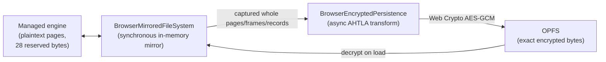

# Browser encrypted storage

`Devolutions.Ahtola.Data.Sqlite.Browser` stores databases in the Origin Private
File System (OPFS) and can encrypt them with Ahtola's AHTLA page format. An
encrypted browser database is a **plain Ahtola encrypted database**: it is not a
browser-specific container, it has no plaintext sidecar, and it opens on the
desktop with `AhtolaEncryptionOptions` (and vice versa).

## Why encryption happens at the persistence boundary

The desktop engine encrypts pages through `IPageCodec`
(`EncryptionPageCodec`), whose `EncodePage`/`DecodePage` are **synchronous**.
Browser Web Crypto (`SubtleCrypto`) is promise-based and has no synchronous
API, so it can never satisfy that contract on the .NET WebAssembly runtime.
Deriving the raw key and using `System.Security.Cryptography.AesGcm` instead is
not an option either: the package's crypto contract is Web Crypto with
non-extractable key handles.

The browser therefore splits the two concerns:

- The engine keeps operating on plaintext, synchronously, exactly as it does
  today. Nothing in `Ahtola.Core` becomes `async` for the browser's benefit.
- `AhtolaBrowserReservedSpaceCodec` is an **identity** `IPageCodec` that
  declares `RequiredReservedBytes = 28`. Binding it makes the pager create
  databases with 28 reserved bytes per page from creation onward, and reject an
  existing database whose reserved space disagrees. Those 28 bytes are where
  the 16-byte AES-GCM tag and 12-byte nonce live once the page is encrypted.
- `BrowserEncryptedPersistence` performs the actual AHTLA transform
  asynchronously while the mirror replays its pending mutations to OPFS.

`IPageCodecSource` (in `Ahtola.Core`) lets the mirror advertise its codec
without being wrapped in `AhtolaPageCodecFileSystem`. Wrapping would hide the
mirror's `IAtomicFileSystem`, `ITemporaryFileSystem`, `IStoragePathResolver`,
and `ISnapshotFileIdentity` implementations, which VACUUM, backup, and the
sorter depend on.

## What is encrypted, and how

`AhtolaEncryptedPageFormat` is the single definition of the byte layout, shared
by the synchronous desktop `AhtolaPageEncryption` and the asynchronous browser
transform. Files are classified by SQLite's naming conventions:

| File | Treatment |
| --- | --- |
| database (`x.db`, attached, VACUUM temporaries) | every page encrypted |
| `x.db-wal` | header plaintext; frame bodies encrypted; rolling checksums recomputed over the **encrypted** bytes |
| `x.db-journal` | header plaintext; page records encrypted; per-record checksum recomputed over the **encrypted** page |
| `x.db-shm` | passthrough — the WAL index is derived, rebuildable metadata |

Page 1 keeps a visible 100-byte header: the `AHTLA` magic, format version 0,
the cipher id, zeroed reserved bytes, and the SQLite header bytes 16..100
copied verbatim. That whole 100-byte prefix is authenticated as AES-GCM
associated data. Every other page has no associated data. This is byte-for-byte
what the desktop engine writes.

Because WAL and journal checksums must cover encrypted bytes, the transform
recomputes them rather than copying the engine's plaintext checksums. The WAL's
rolling chain is seeded by the WAL header's own checksum, which is identical in
both images because the header itself is never encrypted.

## Ordering and durability

The mirror records the engine's exact mutation stream. When encryption is
enabled, each write is **captured at enqueue time**, expanded to the whole
pages, WAL frames, or journal records it touches. Capturing eagerly (rather
than re-reading the final image at flush time) preserves the engine's exact
durability ordering — in particular that a rollback journal is durable before
the database pages it protects are overwritten.

A rollback journal record is built from three separate engine writes (page
number, page image, checksum). The transform persists nothing until the record
is complete, because the encrypted checksum cannot be derived from a partial
page. Records are still emitted before the journal's flush, so crash recovery
is unaffected.

Encryption is applied in `PrepareAsync`, which is side-effect free; WAL chain
state is committed only after the transformed bytes reach OPFS. A cancelled or
failed flush therefore leaves the unreplayed mutations queued and replayable
instead of advancing state or reporting false success.

## Failing closed

There is no plaintext fallback and no cipher inference. Opening encrypted
storage fails with a mapped exception when the key is wrong, the AHTLA header
declares a different cipher, a page fails authentication, or the file turns out
to be a plaintext SQLite database. If the transform ever encounters a write it
cannot map onto whole pages, frames, or records, it throws rather than
persisting plaintext.

## Key material

`AhtolaBrowserEncryptionOptions` accepts an `Ahtola.Password.v1` passphrase
(PBKDF2-HMAC-SHA256, 210,000 iterations, the same domain salt as the desktop
scheme) or an exact AES-128/AES-256 key as raw bytes or hex. Key material is
copied defensively, zeroed on disposal, and **never placed in a connection
string**. The Web Crypto key handle is non-extractable and is released during
disposal, after connections are drained and pending writes are persisted, and
before the OPFS store is closed.
